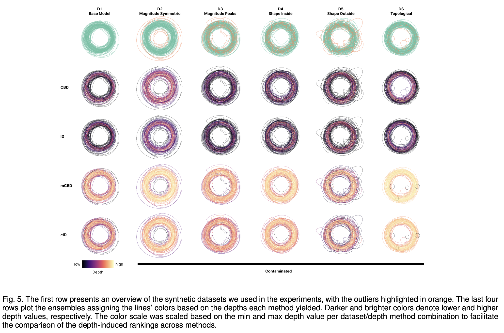

# Inclusion Depth for Contour Ensembles

[](https://opensource.org/licenses/MIT)

Code for the paper Inclusion Depth for Contour Ensembles.

This repository contains the code for the paper:
> Chaves-de-Plaza, N.F., Mody, P., Staring, M., van Egmond, R., Vilanova, A., Hildebrandt, K., Inclusion Depth for Contour Ensembles, 2024, IEEE TCVG (under revision).



If you use our code in your publications please consider citing:
```
@article{chavesdeplaza2024inclusiondepth,
    title={Inclusion Depth for Contour Ensembles},
    author={Chaves-de-Plaza, Nicolas and Mody, Prerak and Staring, Marius and van Egmond, Ren\'{e} and Vilanova, Anna and Hildebrandt, Klaus},
    journal={IEEE Transactions on Visualization and Computer Graphics},
    year={2024},
    volume={TODO},
    number={TODO},
    pages={TODO},    
    doi={TODO},
    eprint={TODO}
}
```

[Future link to paper]

## Setup

1. Install a conda (we recommend using [miniconda](https://docs.conda.io/projects/miniconda/en/latest/))
2. Create environment: `conda create --name=inclusion-depth python=3.9.16`
3. Activate environment: `conda activate inclusion-depth`
4. Install dependencies with pip: `pip install -r requirements.txt`
5. To test installation, from the root of the repository run `python -c "from src.depths.inclusion_depth import compute_depths"`. No errors should be raised.

## Replicating the paper results

The scripts in the `experiments` directory permit replicating the paper's results.
The prefixes `sd` and `rd` denote synthetic data and real data experiments. `sd_exp_data.py` generates data for `sd` experiments. The files `sd_res_*` generate the figures and tables in the paper.
The real data is available from the authors upon request. 

## License and third-party software
The source code in this repository is released under the MIT License. However, all used third-party software libraries are governed by their own respective licenes. Without the following libraries, this project would have been considerably harder: 
[scipy](https://scipy.org),
[TODO](https://numpy.org),